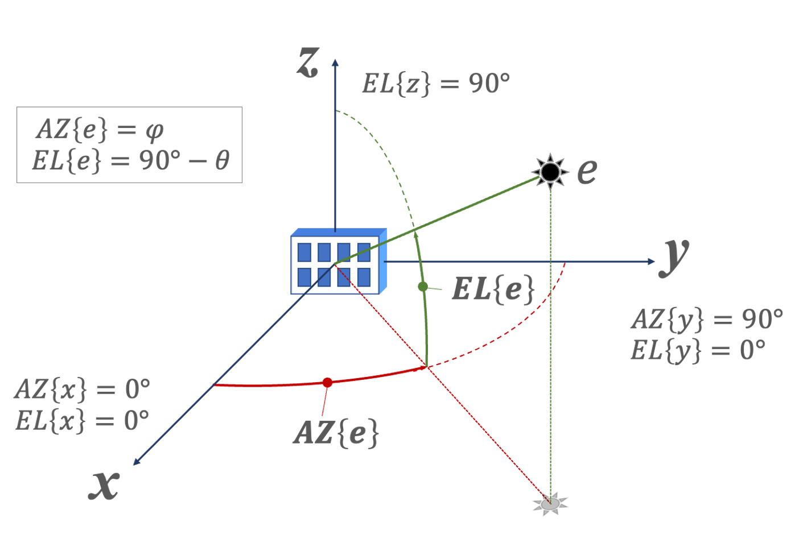

# The `spatial` SigMF Extension Namespace v1.0.0

This document defines the `spatial` extension namespace for the Signal Metadata
Format (SigMF) specification. This extension namespace contains objects to help
store information about spatially diverse data, specifically information applied
to directional antennas and multichannel phase-coherent datasets used for signal
direction of arrival and beamforming.

Multichannel datasets can be stored in SigMF Collections or as multichannel
interleaved data depending on the application. Collections are RECOMMENDED due
to the easier processing and better application support.

The `spatial` extension makes use of cartesian coordinates to define array
geometry, and spherical coordinates for reporting bearings. This, coupled with
the various methods for defining boresights and bearing references can become
complicated rapidly so the union of these two coordinate  reference systems
(CRS) is illustrated in Figure 1 below. The ISO 80000-2:2019 compliant cartesian
and spherical systems have a specific relationship with the reported azimuth and
elevation, which use the conventional geospatial definitions (degrees east of
true north, and degrees above horizon respectively).



**Figure 1 - SigMF Spatial Extension Coordinate Reference Systems**

As shown in Figure 1, the boresight of the aperture is defined as being in the
direction of the positive X-axis. Based on this, as an example, a horizontal
uniform linear array aperture would be defined along the Y-axis (see examples
section below).

## 0 Datatypes

This extension defines the following datatypes:

|name|long-form name|description|
|----|--------------|-----------|
|bearing|signal direction bearing|JSON [bearing](spatial.sigmf-ext.md#01-the-bearing-object) object containing a quantitative representation of a direction with optional error fields.|
|cartesian_point|cartesian position|JSON [cartesian_point](spatial.sigmf-ext.md#02-the-cartesian-point-object) object containing a cartesian coordinate point triplet.|

### 0.1 The `bearing` Object

A `bearing` object is used to describe relative one or two dimensional
directions. The angular fields within the `bearing` object are always specified
in degrees, and linear distances in meters. While it is legal for angular fields
to have any value it is RECOMMENDED that these values be wrapped to a consistent
representation (e.g.: between 0 to 360, or +/- 180).

|name|required|type|units|description|
|----|--------|----|-----|-----------|
|`azimuth`|false|double|degrees|Azimuth component of the direction in degrees increasing clockwise.|
|`elevation`|false|double|degrees|Elevation component of the direction in degrees above horizon.|
|`range`|false|double|meters|Line-of-sight slant range to emitter, if known, in meters.|
|`range_rate`|false|double|meters/second|Time derivative of line-of-sight slant range to emitter, if known, in meters.|
|`az_error`|false|double|degrees|Error or uncertainty in the azimuth component.|
|`el_error`|false|double|degrees|Error or uncertainty in the elevation component.|
|`range_error`|false|double|meters|Error or uncertainty in the range component.|
|`range_rate_error`|false|double|meters/second|Error or uncertainty in the range-rate component.|

The `az_error`, `el_error`, and `range_error` field units are degrees, but the
exact meaning of 'error' in this context is not explicitly defined. Applications
SHOULD specify their specific meaning, and in general this should be interpreted
as an uncertainty range. The error fields SHOULD NOT be included if the
corresponding estimate fields are not present.

An example of a `bearing` object is shown below:

```json
  "bearing": {
    "azimuth": 211.2,
    "elevation": 15.0,
    "range": 30,
    "range_rate": -1.3,
    "az_error": 2.5,
    "el_error": 7.5,
    "range_error": 0.25,
    "range_rate_error": 0.02
  }
```

### 0.2 The `cartesian_point` Object

A `cartesian_point` object is used to describe a single point in the Cartesian
coordinate reference system. This object is necessary to define the phase center
geometries for multidimensional arrays, and other cartesian locations.

|name|required|type|units|description|
|----|--------|----|-----|-----------|
|`point`|false|array|meters|A point defined by three double elements [x,y,z] referenced to the `spatial` CRS.|
|`unknown`|false|bool|N/A|Always set to `true` - indicates that this point is not known.|

`cartesian_point` objects represent a point in 3D space, and MUST contain either
a `point` or `unknown` field. `unknown` fields are placeholders when the exact
information is not known or does not matter.

## 1 Global

The `spatial` extension adds the following fields to the `global` SigMF object:

|name|required|type|units|description|
|----|--------|----|-----|-----------|
|`num_elements`|true|int|N/A|Defines the number of phase centers / channels collected in the Collection or multichannel Dataset.|
|`channel_index`|true|int|N/A|The channel number, represents the index into `element_geometry`.|

The number of elements MUST be defined here and is constant for a given
Collection. It may be tempting to use the `core:num_channels` field however
that field specifies how many interleaved channels are present in a single
Dataset whereas spatial Recordings may be spread over several individual
Datasets in a SigMF Collection.

In the case of a multichannel dataset, the `channel_index` specifies the first
channel in the dataset. If all data is contained within that dataset then the
`channel_index` field MUST be equal to zero.

## 2 Captures

The `spatial` extension adds the following fields to `captures` segment objects:

|name|required|type|units|description|
|----|--------|----|-----|-----------|
|`aperture_azimuth`|false|double|degrees|Azimuth of the aperture boresight in degrees east of true north.|
|`aperture_bearing`|false|[bearing](spatial.sigmf-ext.md#01-the-bearing-object)|N/A|Bearing of aperture boresight in this segment.|
|`emitter_bearing`|false|[bearing](spatial.sigmf-ext.md#01-the-bearing-object)|N/A|Bearing of signals in this segment.|
|`element_geometry`|false|array|N/A|An array containing `cartesian_point` objects that specify the relative physical geometry of the antenna elements.|
|`phase_offset`|false|double|degrees|Phase offset of the data in this capture relative to a common phase reference plane.|
|`calibration`|false|[calibration](spatial.sigmf-ext.md#21-the-calibration-object)|Reserved for calibration.|

The `aperture_bearing` field within a `captures` segment can be used to specify
a fixed aperture boresight bearing. For single element or uniform planar array
apertures, the boresight is defined as the direction of peak gain when fed with
a uniform phase signal; for more complicated arrays this value is determined by
antenna mechanical or electrical geometry and will be specific to the design.
The azimuth is specified in degrees east of true north and elevation (if
provided) is in degrees above the horizon. The `aperture_azimuth` field is also
available for simpler specification when this is more appropriate.

The `emitter_bearing` field within a `captures` segment is used to specify the
ground truth bearing of all signals contained within a multichannel dataset,
relative to the `aperture_bearing`. This is useful for reference data which is
well controlled, but is not well suited for arbitrary signals or data with more
than one emitter location.

The `element_geometry` object MAY be included in each `captures` segment to
specify phase center geometry at different frequencies. Including this in the
`captures` segment is optional, and is only needed for multi frequency captures
where the element phase centers also move with frequency. This object MUST be
defined if there is not a `sigmf-collection` file that specifies the
`element_geometry`. This array MUST be of length `num_elements` (if specifying
the geometry of the entire array), OR of length `core:num_channels` (if
specifying only the elements contained in this Recording). The `captures` scope
definition of `element_geometry` SHALL take priority over a value specified in
a `collection`.

The `phase_offset` field is a double precision value used when a dataset is
captured from a RF device that is phase coherent but not phase-aligned. Datasets
making use of this field can be post-processed to align the data and this field
can be set to zero. This value is normally relative to channel 0, and therefore
will be zero for channel 0. If this field is omitted then it is assumed that the
value is zero, and thus it is always OPTIONAL for channel 0 or datasets that are
already phase aligned. Including this value set to zero can explicitly identify
the dataset as phase-aligned. To phase-align the data to the phase reference
plane, the inverse of this factor is applied: exp(-i*radians(phase_offset)).

### 2.1 The `calibration` Object

The `calibration` object is a special captures segment metadata field that
indicates the segment is used for calibration. This might be used to show that
a tone or broadband noise signal was generated to perform phase alignment in
post-processing. The resulting value from post-processing calibration can then
be stored in the `captures` object `phase_offset` field.

If this field is not defined for a `captures` segment, then that segment SHOULD
be treated as normal data.

|name|required|type|description|
|----|--------|----|-----------|
|`caltype`|true|string|A specific [caltype](spatial.sigmf-ext.md#211-the-caltype-field).|
|`bearing`|false|bearing|The bearing of the calibration signal.|
|`cal_geometry`|false|`cartesian_point`|The position of the calibration antenna phase center relative to the `spatial` CRS.|

Either the `bearing` or `cal_geometry` field SHOULD be provided if a captures
segment includes the `calibration` field. The `bearing` object is best used to
describe a remote calibration source location in a spherical coordinate system,
while the `cal_geometry` is best used when the calibration emitter is local to
the multi-element array.

#### 2.1.1 The `caltype` field

The `caltype` field can have one of the following values:

|value|description|
|-----|-----------|
|`tone`|This segment contains a tone for calibration purposes.|
|`xcorr`|This segment contains a signal for cross-correlation calibration purposes.|
|`ref`|A known reference emission.|
|`other`|This segment contains another type of calibration signal.|

## 3 Annotations

This extension adds the following optional fields to the `annotations` SigMF
object:

|name|required|type|units|description|
|----|--------|----|-----|-----------|
|`signal_azimuth`|false|double|degrees|Azimuth in degrees east of true north associated with the specific annotation.|
|`signal_bearing`|false|[bearing](spatial.sigmf-ext.md#01-the-bearing-object)|N/A|Bearing associated with the specific annotation.|
| `geolocation`  | false    | GeoJSON `point` Object | N/A | The location (either known or estimated) of the transmitter corresponding to this annotation |

These first two fields represent the direction to a specific signal relative to the
`aperture_bearing` and can be utilized when the signals contained in a Recording
need to be defined on a per-signal basis. The `signal_azimuth` field is provided
for simplicity because many applications only require azimuth, but the
`signal_bearing` field is also provided for when elevation, range, and/or
measurement error is needed. Only one of these SHOULD be used for an individual
annotation; if both are provided the `signal_bearing` object has priority.

`geolocation` uses the same GeoJSON `point` Object as in the `core` spec, but here it corresponds to an emission or signal, not the receiving platform's position.
For example, this field could be used to store results of TDOA performed on an emission, or it could be used to label a known position of a transmitter.
See `core` spec for more details on GeoJSON `point` Objects.

## 4 Collection

This extension adds the following fields to the SigMF `collection` object:

|name|required|type|units|description|
|----|--------|----|-----|-----------|
|`element_geometry`|true|array|N/A|An array of `cartesian_point` objects that specify the nominal electrical geometry of the array elements in this collection.|

The `element_geometry` field describes the phase center geometry of each element
relative to the `spatial` coordinate reference system and MUST be specified for
collections implementing the `spatial` extension, though the `point` may be
`unknown`. Single channel datasets should contain a single `point` at `[0,0,0]`.
If the `captures` object of a Recording defines this field, that value should be
used at a higher priority than what is specified here.

## 5 Examples

Here is an example of how the `global` and captures fields can be specified for
a single channel Recording of a four element uniform linear array with element
spacing of 20cm pointed due west with annotated signal emissions originating
from the north-east. Note that the `signal_azimuth` fields show in the
`annotations` metadata reflect an aimuth of approximately 135* instead of the
expected 45* (north-east). This is because annotation azimuths are documented
relative to the boresight of the antenna. To convert to degrees east of true
north, the aperture azimuth must be accounted for:

`(270 + 135) % 360 = 45`

```json
{
  "global": {
    "core:datatype": "ci16_le",
    "core:sample_rate": 40000000,
    "antenna:gain": 0,
    "spatial:num_elements": 4,
    "spatial:channel_index": 0
  },
  "captures": [
    {
      "core:sample_start": 0,
      "core:frequency": 740000000.0,
      "spatial:aperture_azimuth": 270.0,
      "spatial:element_geometry": [
        { "point": [0, 0.3,0] }
      ]
    }
  ],
  "annotations": [
    {
      "core:sample_start": 38012637,
      "core:sample_count": 100991,
      "core:freq_upper_edge": 731503448.0,
      "core:freq_lower_edge": 730165112.0,
      "spatial:signal_azimuth": 133.821
    },
    {
      "core:sample_start": 780208811,
      "core:sample_count": 100018,
      "core:freq_upper_edge": 731250189.0,
      "core:freq_lower_edge": 730165114.0,
      "spatial:signal_azimuth": 135.904
    },
    ...
  ]
}
```

This is an example of how to report the observed direction of annotations, in
this case they are originating from the 4 o'clock position:

```json
{
  ...
  "annotations": [
    {
      "core:sample_start": 0,
      "core:sample_count": 50944,
      "core:freq_upper_edge": 2401000000,
      "core:freq_lower_edge": 2402000000,
      "core:description": "burst",
      "spatial:signal_bearing": {
        "azimuth": 120.2,
        "az_error": 0.5
      }
    },
    ...
  ]
}
```

Here is an example of a 6 element uniform planar array pointed approximately due
north that is detecting emissions from an emitter located east north-east from
the aperture (see figure above for reference).

```json
{
  "global": {
    "core:datatype": "ci16_le",
    "core:sample_rate": 40000000,
    "antenna:gain": 6,
    "spatial:num_elements": 6,
    "spatial:channel_index": 4
  },
  "captures": [
    {
      "core:sample_start": 0,
      "core:frequency": 1260000000.0,
      "spatial:aperture_bearing": {
        "azimuth": 1.13124
      },
      "spatial:element_geometry": [
        { "point": [0, 0.1, 0.05] },
        { "point": [0,   0, 0.05] },
        { "point": [0,-0.1, 0.05] },
        { "point": [0, 0.1,-0.05] },
        { "point": [0,   0,-0.05] },
        { "point": [0,-0.1,-0.05] }
      ]
    }
  ],
  "annotations": [
    {
      "core:sample_start": 8424351,
      "core:sample_count": 88741,
      "core:freq_upper_edge": 1248111918.0,
      "core:freq_lower_edge": 1245718776.0,
      "core:description": "burst",
      "spatial:signal_bearing": {
        "azimuth": 59.431,
        "elevation": 13.681,
        "az_error": 1.3421,
        "el_error": 4.1192
      }
    },
    {
      "core:sample_start": 13843284,
      "core:sample_count": 96438,
      "core:freq_upper_edge": 1271283241.0,
      "core:freq_lower_edge": 1268532007.0,
      "core:description": "burst",
      "spatial:signal_bearing": {
        "azimuth": 60.994,
        "elevation": 17.324,
        "az_error": 0.9694,
        "el_error": 3.8474
      }
    },
    ...
  ]
}
```

Here is an example of a four element aperture with square geometry in the XY plane:

```json
{
  "global": {
    "core:datatype": "ci16_le",
    "core:sample_rate": 40000000,
    "antenna:gain": 6,
    "spatial:num_elements": 4,
    "spatial:channel_index": 0
  },
  "captures": [
    {
      "core:sample_start": 0,
      "core:frequency": 160000000.0,
      "spatial:element_geometry": [
        { "point": [ 0.25, 0.25,0] },
        { "point": [ 0.25,-0.25,0] },
        { "point": [-0.25,-0.25,0] },
        { "point": [-0.25, 0.25,0] }
      ]
    }
  ],
  "annotations": [
    {
      "core:sample_start": 38012637,
      "core:sample_count": 100991,
      "core:freq_upper_edge": 165125034.0,
      "core:freq_lower_edge": 165112388.0,
      "spatial:signal_azimuth": 202.812
    },
    {
      "core:sample_start": 780208811,
      "core:sample_count": 100018,
      "core:freq_upper_edge": 165125018.0,
      "core:freq_lower_edge": 165112371.0,
      "spatial:signal_azimuth": 200.142
    },
    {
      "core:sample_start": 118009143,
      "core:sample_count": 99841,
      "core:freq_upper_edge": 165125041.0,
      "core:freq_lower_edge": 165112369.0,
      "spatial:signal_azimuth": 197.681
    },
    {
      "core:sample_start": 158007123,
      "core:sample_count": 101041,
      "core:freq_upper_edge": 165125023.0,
      "core:freq_lower_edge": 165112401.0,
      "spatial:signal_azimuth": 195.017
    },
    ...
  ]
}
```

An example `collection` object implementing the `spatial` extension for a four
element recording:
```JSON
{
    "collection": {
        "core:version": "v1.0.0",
        "core:extensions" : [
            {
            "name": "spatial",
            "version": "1.0.0",
            "optional": false
            }
        ],
        "core:streams": [
            ["example-channel-0-basename", "hash"],
            ["example-channel-1-basename", "hash"],
            ["example-channel-2-basename", "hash"],
            ["example-channel-3-basename", "hash"]
        ],
        "spatial:element_geometry": [
            { "point": [ 0.5, 0.5,0] },
            { "point": [ 0.5,-0.5,0] },
            { "point": [-0.5,-0.5,0] },
            { "point": [-0.5, 0.5,0] }
        ]
    }
}
```
