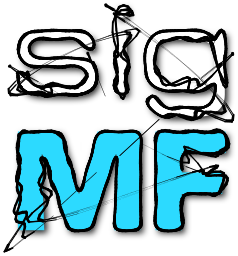

# The Official SigMF Logo

The provided SigMF pair [sigmf_logo.sigmf-meta](sigmf_logo.sigmf-meta) and [sigmf_logo.sigmf-data](sigmf_logo.sigmf-data) represent the stereo audio that is the official SigMF logo.

The intent of these files is to both serve as a nice visual and an exemplar metadata to be used as a reference. The `png` is just a simplified view of the logo as rendered on an XY-oscilloscope per the below gist.

## Additional Versions

The full logo archive found (@bhilbern insert) contains a variety of versions of the logo for multiple use-cases.

* `sigmf_logo_fullband` is the unfiltered logo at 192 KHz sample rate.
* `logo_*.wav` are audio files for playback without converstion from SigMF.
* `logo_manifold.stl` is a logo suitable for 3d printing.
* `logo_*.mp4` are XY-oscilloscope videos rendered from the SigMF logo.
* `logo-scope.*` are vectors & images rendered directly from the SigMF dataset using [this gist](https://gist.github.com/Teque5/3a377440916506fb2ac46a9f47251da4i).
* `logo-*.svg` are various vector versions of the logo.
* `logo-icon-*.png` are various icons for folders or discord in multiple sizes.

## How was this created?

The SigMF logo was created with the following steps:

0) Initial render in [Blender](https://www.blender.org/) with as simple geometry as possible. The `stl` is a very simplified and tweaked version of the [Eurostile](https://en.wikipedia.org/wiki/Eurostile) font.
1) A timeline was created with [OsciStudio](https://oscilloscopemusic.com/oscistudio.php) with various modulated artifacts over a 6 second period.
2) The lower 48KHz version was then lowpass filtered and adjusted for -14 LUFS in [Audacity](https://www.audacityteam.org/) per the [EBU R 128](https://en.wikipedia.org/wiki/EBU_R_128) loudness spec.
3) Original metadata was added with Python.
